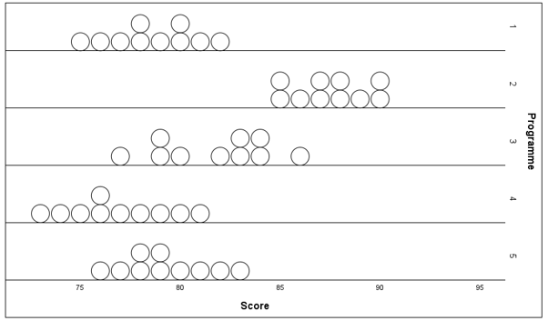
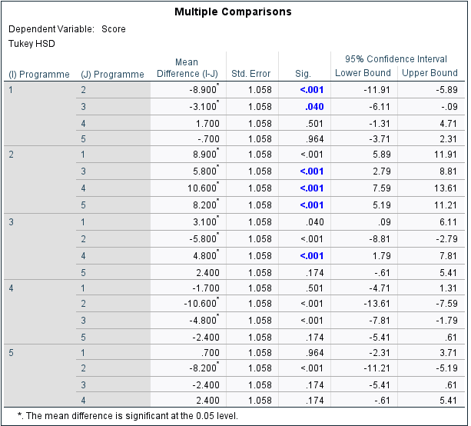
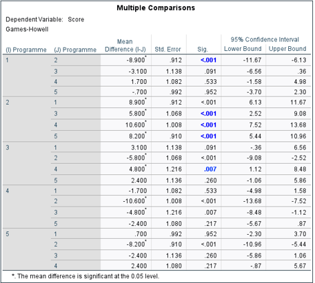

# ANOVA and Principal Component Analysis

A Year 2 statistics project completed at Heriot-Watt University Malaysia, applying statistical hypothesis testing and multivariate analysis using SPSS and R.

| Detail | Information |
|---|---|
| Program | Bachelor of Science (Hons) in Statistical Data Science |
| Course | F79PS Further Statistical Methods |
| Year and Semester | Year 2, Semester 1 |
| Date | November 2024 |
| Software/Language | SPSS, R |
| Marks Obtained | Q1a (4.5/6) + Q1b (3/3) + Q1c (4/6) + Q2a (6.5/7) + Q2b (2.5/3) + Q2c (1.5/3) + Q2d (2/2) + Q2e (2/2) = 26/32 |

## About the Project

Applied statistical methods to analyse datasets involving employee training performance and music characteristics.

The project investigated whether different training programmes produced significant differences in risk prediction accuracy using analysis of variance methods. Principal Component Analysis (PCA) was also performed to reduce multiple music features into fewer components and identify underlying patterns.

## What I Did

- Checked ANOVA assumptions, including distribution patterns and equality of variances.
- Performed one-way ANOVA to investigate differences between training programmes.
- Analysed effect size and statistical significance of group differences.
- Conducted planned and post-hoc comparisons using Tukey HSD and Games-Howell tests.
- Applied Principal Component Analysis (PCA) to simplify multiple music characteristics.
- Interpreted statistical outputs from SPSS and R.

## Results

### ANOVA Assumption Check

The distribution of risk prediction accuracy scores across the five training programmes was examined before performing ANOVA.

### One-Way ANOVA

The ANOVA test produced an F-statistic of 30.357 with a significance level below 0.001, indicating strong evidence that the mean accuracy scores differ between training programmes.

### Post-Hoc Comparisons

#### Tukey HSD Test

Tukey HSD was used for pairwise comparisons between programmes while controlling the overall family error rate.

#### Games-Howell Test

Games-Howell comparisons were performed as an alternative post-hoc method for analysing differences between programme groups.

### Principal Component Analysis

PCA was applied to music feature data to reduce multiple variables into principal components. The first two principal components were visualised to identify patterns and relationships between observations.

## Skills Demonstrated

- Statistical hypothesis testing.
- Analysis of variance (ANOVA).
- Post-hoc comparison methods.
- Principal Component Analysis (PCA).
- Statistical analysis using SPSS.
- Data visualisation and interpretation using R.

## Availability

The full submitted report is kept private but can be requested by contacting me at: 29natasha.sj@gmail.com

---

[Back to Degree Projects](../README.md)
