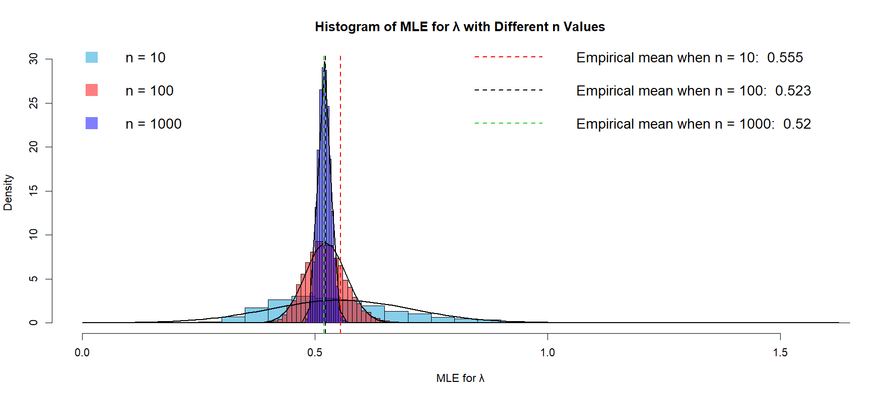
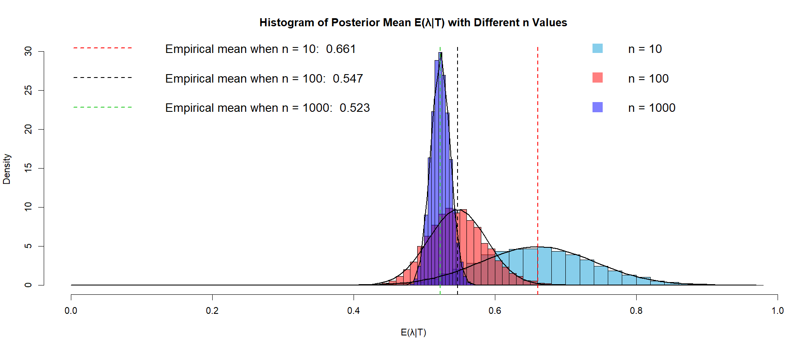
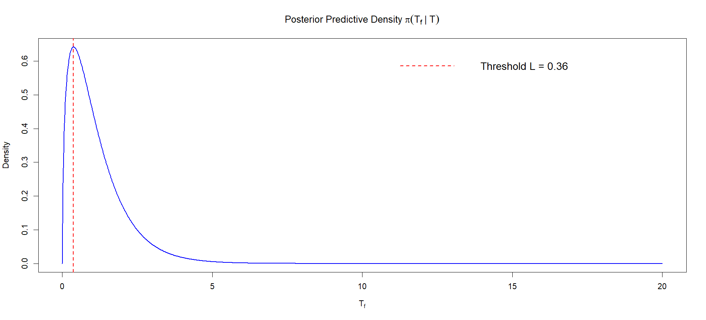

# Bayesian Estimation and Predictive Modelling

A Year 2 statistics project completed at Heriot-Watt University Malaysia, combining Bayesian statistical modelling, mathematical derivations and simulations in R.

| Detail | Information |
|---|---|
| Program | Bachelor of Science (Hons) in Statistical Data Science |
| Course | F79MA Statistical Models A |
| Year and Semester | Year 2, Semester 1 |
| Date | November 2024 |
| Language | R |
| Tool | RStudio |
| Marks Obtained | 15.5/17 (Report) + 3/3 (Code) = 18.5/20 |

## About the Project

Investigated the lifetime of drilling machine components using the Maxwell distribution in a semiconductor manufacturing scenario. Classical and Bayesian estimation methods were applied to estimate the unknown rate parameter, while simulations were used to evaluate estimator performance and predictive reliability.

## What I Did

- Derived the posterior distribution using a Gamma prior and likelihood function.
- Derived the posterior mean estimator for the unknown parameter.
- Developed R simulations to generate samples and evaluate estimator behaviour.
- Analysed bias, consistency, efficiency and asymptotic normality of estimators across different sample sizes.
- Derived and evaluated the posterior predictive distribution using the generalized beta prime distribution.
- Estimated a failure threshold for future component lifetimes.

## Results

### Maximum Likelihood Estimator

The simulation shows that the MLE becomes more stable and precise as sample size increases.

### Bayesian Posterior Mean

The posterior mean approaches the true parameter value with larger sample sizes, showing improved estimation accuracy.

### Posterior Predictive Distribution

The predictive distribution was used to estimate the probability of future component failures and determine a reliability threshold.

## Skills Demonstrated

- Bayesian statistical modelling.
- Statistical inference and mathematical derivation.
- Monte Carlo simulation in R.
- Probability distribution analysis.
- Reliability and predictive modelling.
- Data visualisation and interpretation.

## Availability

The full submitted report and R script are kept private but can be requested by contacting me at: 29natasha.sj@gmail.com

---

[Back to Degree Projects](../README.md)
