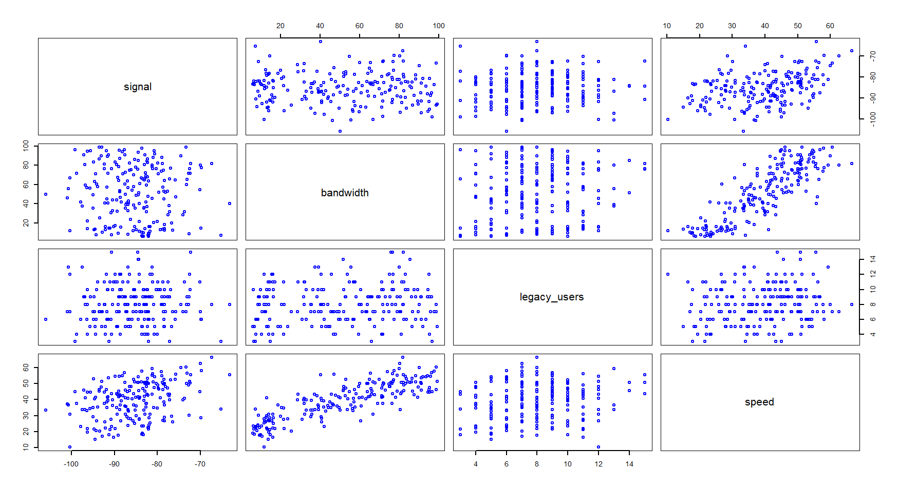
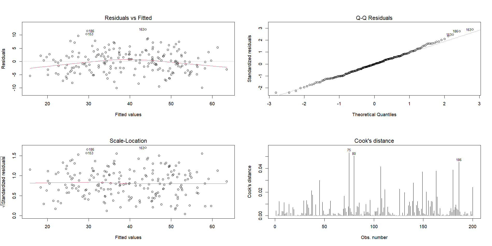
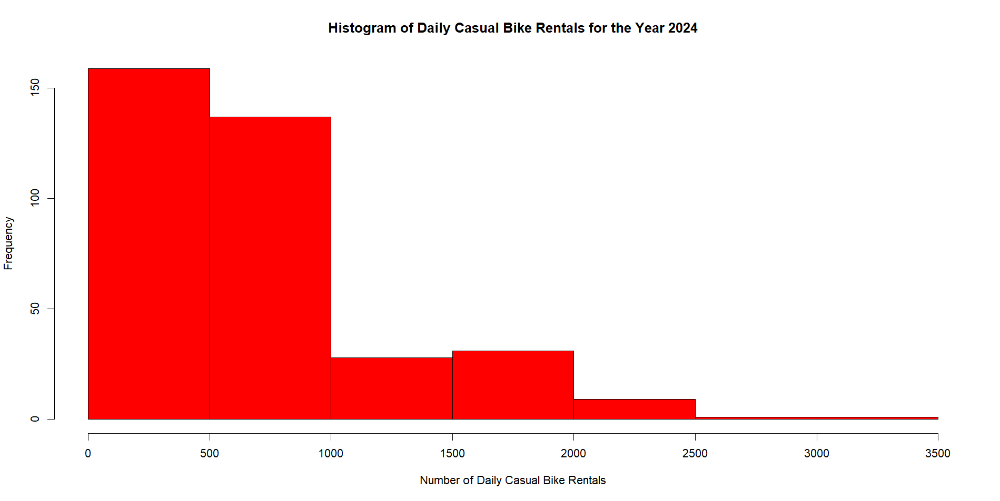
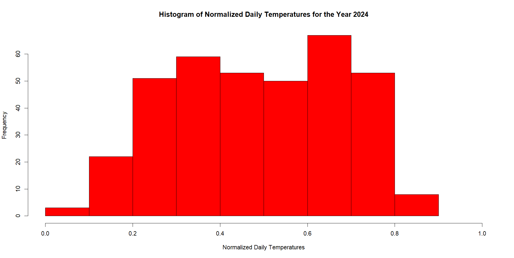
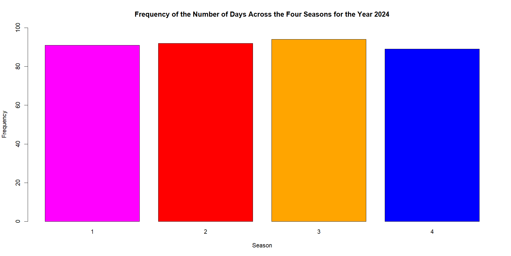
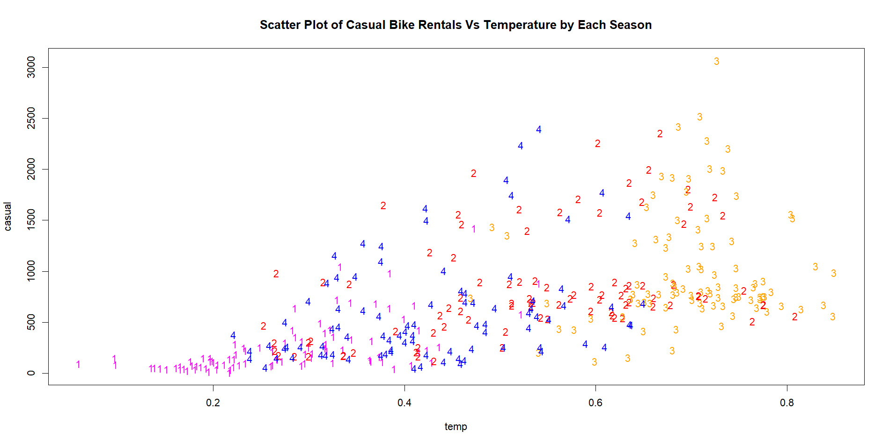
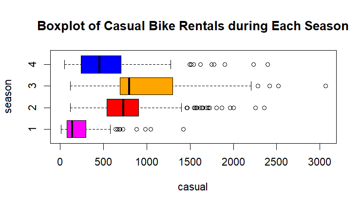
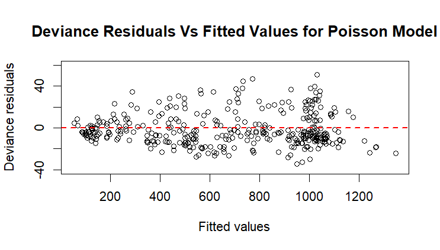
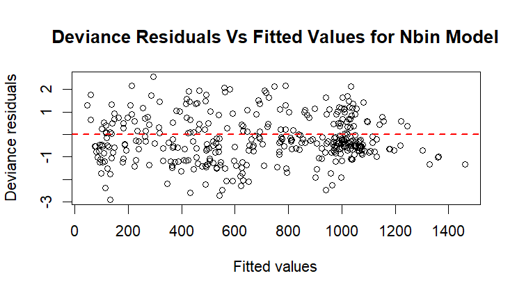

# Statistical Modelling of Mobile Networks and Bike Rental Demand

A Year 2 statistical modelling project completed at Heriot-Watt University Malaysia, applying regression modelling, generalised linear models and statistical inference techniques using R.

| Detail | Information |
|---|---|
| Program | Bachelor of Science (Hons) in Statistical Data Science |
| Course | F79MB Statistical Models B |
| Year and Semester | Year 2, Semester 2 |
| Date | February 2026 |
| Language | R |
| Tool | RStudio |
| Marks Obtained | 53.5/60 |

## About the Project

This project applied statistical modelling techniques to analyse two different real-world datasets.

The first analysis investigated factors affecting mobile network speed using multiple linear regression. Relationships between network speed and explanatory variables such as signal strength, bandwidth and legacy users were explored before developing and assessing regression models.

The second analysis focused on modelling daily casual bike rental demand using Generalized Linear Models (GLMs). Poisson and Negative Binomial regression models were applied and evaluated for modelling count data.

## What I Did

- Performed exploratory data analysis using graphical and numerical methods.
- Investigated relationships between explanatory variables using scatterplot matrices.
- Developed multiple linear regression models for mobile network speed.
- Compared regression models using statistical significance and model diagnostics.
- Assessed regression assumptions using residual analysis and Q-Q plots.
- Analysed bike rental demand patterns based on temperature and season.
- Applied Poisson and Negative Binomial regression models for count data.
- Compared model suitability using diagnostic assessment.

---

# Analysis 1: Mobile Network Speed Modelling

## Exploratory Data Analysis

A scatterplot matrix was used to examine relationships between mobile network speed and potential explanatory variables.

The analysis explored relationships between:

- Signal strength
- Bandwidth
- Legacy users
- Mobile network speed

The dataset contained observations of signal, bandwidth, legacy users and achieved speed measurements. 

The exploratory analysis suggested that bandwidth had a strong relationship with network speed, supporting its inclusion as a predictor in regression modelling.

## Regression Modelling and Diagnostics

Multiple linear regression models were developed to explain variation in mobile network speed.

Diagnostic plots were used to evaluate:

- Linearity assumptions
- Residual behaviour
- Normality of residuals
- Potential influential observations

The final regression model was selected based on statistical significance and diagnostic evaluation.

---

# Analysis 2: Bike Rental Demand Modelling

## Exploratory Data Analysis

The distribution of daily casual bike rentals was first examined.

The response variable showed characteristics of count data with considerable variation between observations.

Temperature distribution was also explored.

Seasonal variation was analysed using frequency plots.

## Relationship Between Temperature and Rental Demand

The relationship between temperature and casual bike rentals was investigated across different seasons.

Seasonal differences in rental behaviour were further explored using boxplots.

The analysis showed that rental demand varied across seasons, with warmer conditions generally associated with higher casual rental counts.

---

# Generalised Linear Model Analysis

## Poisson Regression

A Poisson regression model was developed to model daily casual bike rental counts.

Model diagnostics were examined using deviance residuals.

## Negative Binomial Regression

A Negative Binomial regression model was also evaluated as an alternative approach for count data.

The two approaches were compared based on model suitability and diagnostic behaviour. The Negative Binomial model provided a more flexible approach when accounting for variation commonly observed in count data.

---

# Skills Demonstrated

- Exploratory data analysis.
- Multiple linear regression.
- Regression diagnostics and assumption checking.
- Model evaluation and selection.
- Generalised Linear Models.
- Poisson regression.
- Negative Binomial regression.
- Statistical interpretation and reporting.
- Data visualisation using R.

---

# Dataset

The datasets used in this project are included in the `data` folder.

Included files:

- `MobileNetwork.txt`
  - Contains mobile network observations including signal strength, bandwidth, legacy users and achieved speed. 

- `rent.csv`
  - Contains bike rental observations used for GLM analysis.

---

# Availability

The repository contains the datasets, selected visualisations and an analysis summary.

The full coursework notebook and submission files are kept private but can be requested by contacting me at: 29natasha.sj@gmail.com

---

[Back to Degree Projects](../README.md)
