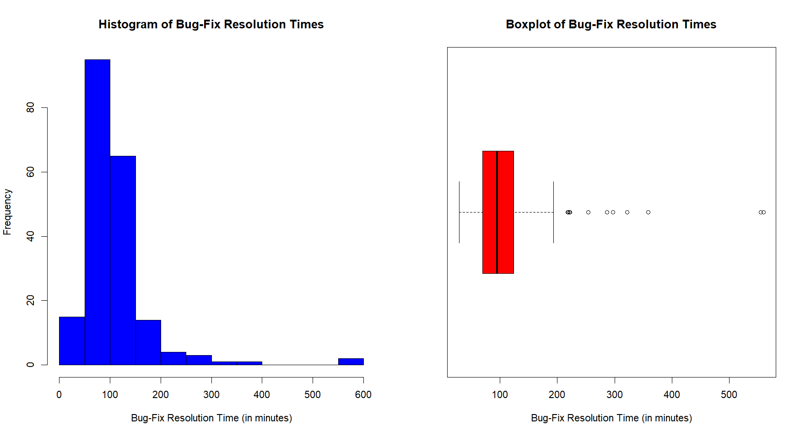
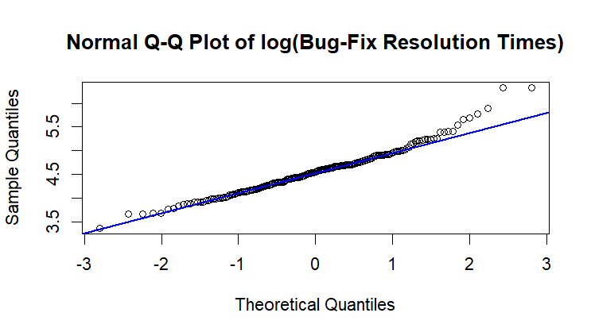
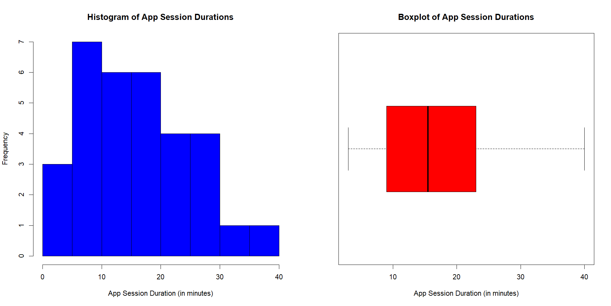
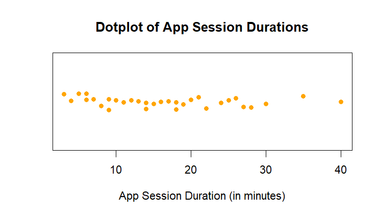
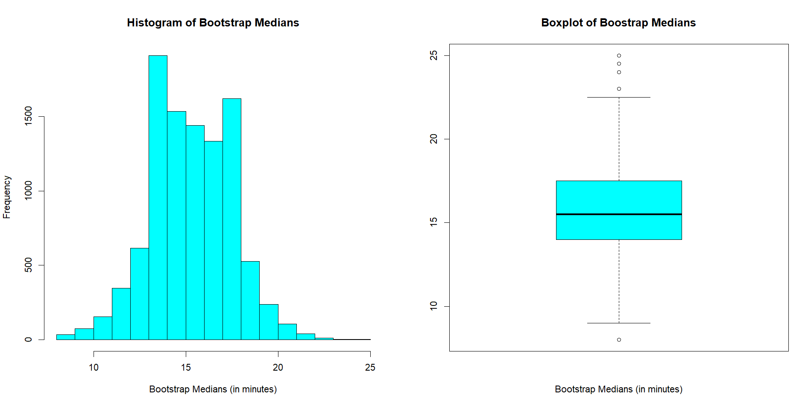
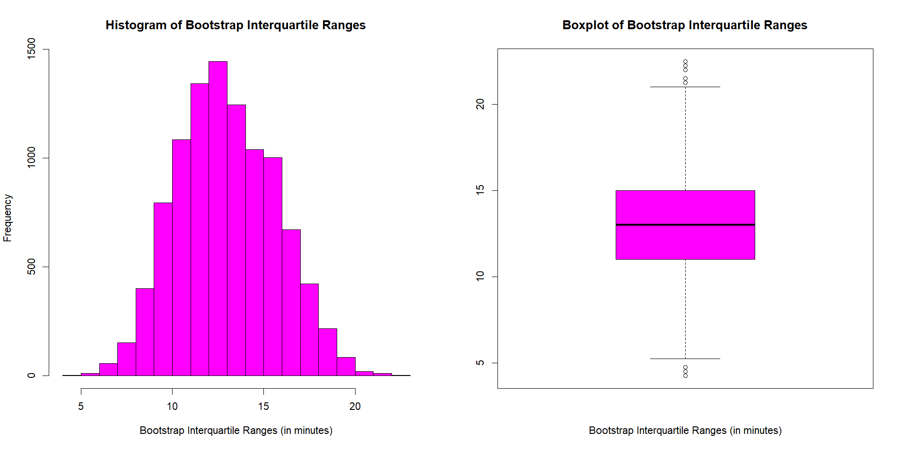
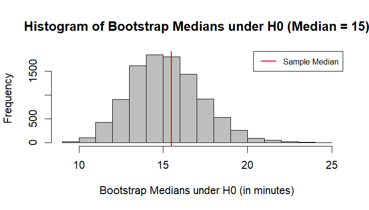

# Statistical Modelling of Software Bugs and Mobile App Usage

A Year 2 statistics project completed at Heriot-Watt University Malaysia, applying statistical modelling, maximum likelihood estimation and bootstrap inference using R.

| Detail | Information |
|---|---|
| Program | Bachelor of Science (Hons) in Statistical Data Science |
| Course | F79MB Statistical Models B |
| Year and Semester | Year 2, Semester 2 |
| Date | February 2026 |
| Language | R |
| Tool | RStudio |
| Marks Obtained | 36/40 |

## About the Project

Applied statistical modelling techniques to analyse two datasets involving software bug resolution times and mobile application session durations.

The first analysis investigated software bug-fix resolution times by fitting a lognormal model using maximum likelihood estimation and assessing model suitability through goodness-of-fit analysis.

The second analysis examined mobile application session durations using bootstrap-based inference methods, including confidence interval estimation and hypothesis testing.

## What I Did

- Performed exploratory data analysis using numerical summaries and graphical methods.
- Analysed distribution characteristics including skewness, variability and potential outliers.
- Applied logarithmic transformation to model highly skewed data.
- Derived and calculated maximum likelihood estimates for distribution parameters.
- Assessed distribution assumptions using Q-Q plots.
- Performed chi-squared goodness-of-fit testing for fitted distributions.
- Applied non-parametric bootstrap methods to estimate confidence intervals.
- Conducted bootstrap hypothesis testing using simulated samples.

## Results

### Software Bug Resolution Time Analysis

The bug-fix resolution times showed strong positive skewness with several unusually large values. This indicated that modelling the original data directly using a normal distribution would not be appropriate, motivating the use of a lognormal model.

### Lognormal Model Assessment

The Q-Q plot of the log-transformed bug-fix times showed an approximately linear pattern for most observations, supporting the assumption that the transformed data could reasonably be modelled using a normal distribution.

### Mobile Application Session Duration Analysis

The app session durations showed moderate positive skewness and variability, with some longer sessions observed.

The dotplot displays individual session durations, providing additional insight into the spread of observations and the distribution of the sample.

### Bootstrap Confidence Interval for Median

A non-parametric bootstrap procedure was used to generate the empirical sampling distribution of the sample median. This allowed estimation of uncertainty without relying on strong distributional assumptions.

### Bootstrap Confidence Interval for IQR

Bootstrap resampling was applied to estimate the uncertainty of the interquartile range, providing insight into the variability of app session durations.

### Bootstrap Hypothesis Testing

A parametric bootstrap hypothesis test was conducted to evaluate the claim that the population median app session duration was 15 minutes or less.

## Skills Demonstrated

- Statistical modelling and inference.
- Maximum likelihood estimation.
- Distribution fitting and goodness-of-fit testing.
- Lognormal modelling.
- Bootstrap confidence intervals.
- Simulation-based hypothesis testing.
- Data analysis and visualisation using R.

## Dataset

The datasets used in this project are included in the `data` folder.

Included files:

- `bug_time.txt` — Software bug-fix resolution time observations.
- `app_session_duration.txt` — Mobile application session duration observations.

## Availability

The repository contains the datasets, selected visualisations and an analysis summary.

The full coursework notebook and submission files are kept private but can be requested by contacting me at: 29natasha.sj@gmail.com

---

[Back to Degree Projects](../README.md)
