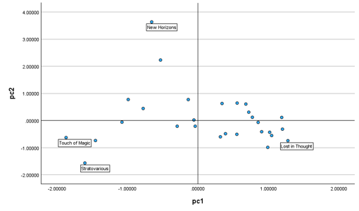

# Further Statistical Methods — Assessed Project

A Year 2 statistics project completed at Heriot-Watt University Malaysia, applying statistical hypothesis testing and multivariate analysis using SPSS and R.

| Detail | Information |
|---|---|
| Program | Bachelor of Science (Hons) in Statistical Data Science |
| Course | F79PS Further Statistical Methods |
| Year and Semester | Year 2, Semester 1 |
| Date | November 2024 |
| Software/Language | SPSS, R |
| Marks Obtained | Q1a (4.5/6) + Q1b (3/3) + Q1c (4/6) + Q2a (6.5/7) + Q2b (2.5/3) + Q2c (1.5/3) + Q2d (2/2) + Q2e (2/2) = 26/32 |

## About the Project

Applied statistical methods to analyse real-world datasets involving employee training performance and music characteristics.

The project investigated whether different training programmes produced significant differences in risk prediction accuracy using analysis of variance methods. Principal Component Analysis was also performed to reduce the dimensionality of music feature data and identify underlying patterns.

## What I Did

- Conducted assumption checks for one-way ANOVA including normality and equality of variances.
- Performed one-way ANOVA to evaluate differences between training programme groups.
- Analysed effect size and statistical power of the treatment differences.
- Performed planned contrast analysis between selected training programmes.
- Conducted Tukey HSD and Games-Howell post-hoc comparisons.
- Applied Principal Component Analysis (PCA) to simplify multiple music features into fewer components.
- Interpreted statistical outputs and visualised findings using statistical software.

## Results

### One-Way ANOVA Analysis

The analysis identified significant differences in prediction accuracy scores between training programmes, with the training programme factor showing a large effect on performance.

### Post-Hoc Comparisons

Pairwise comparisons were performed to determine which training programmes had statistically significant differences.

### Principal Component Analysis

PCA was used to transform multiple music characteristics into principal components, helping identify patterns and simplify data representation.

## Skills Demonstrated

- Statistical hypothesis testing.
- Analysis of variance (ANOVA).
- Post-hoc analysis.
- Principal Component Analysis (PCA).
- Statistical interpretation using SPSS.
- Data analysis and visualisation using R.

## Availability

The full submitted report is kept private but can be requested by contacting me at: 29natasha.sj@gmail.com

---

[Back to Degree Projects](../README.md)
