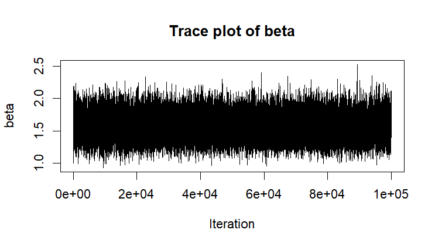
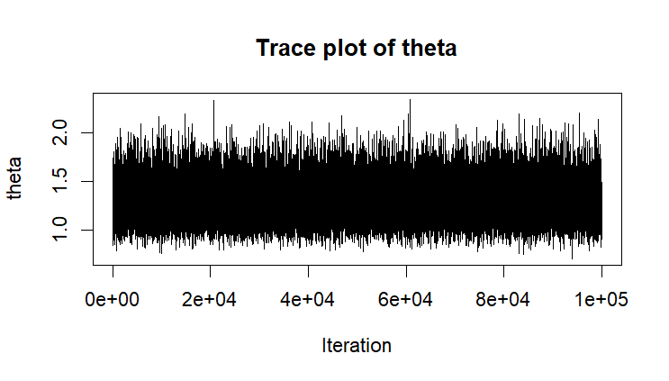
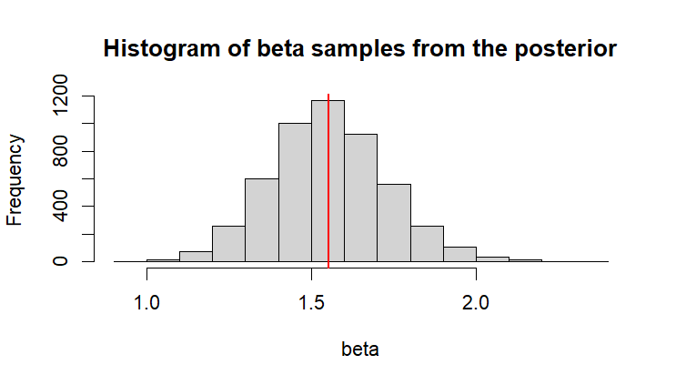
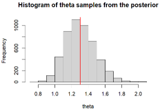
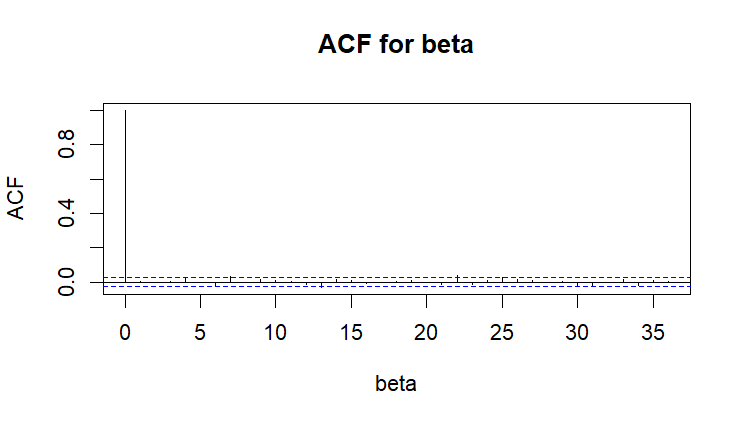
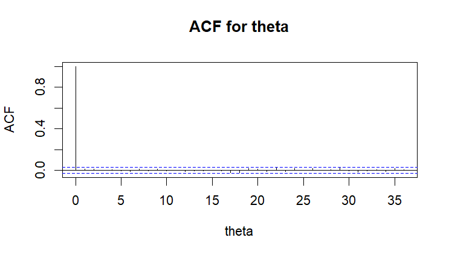
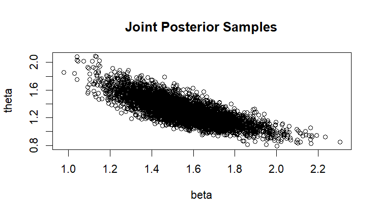
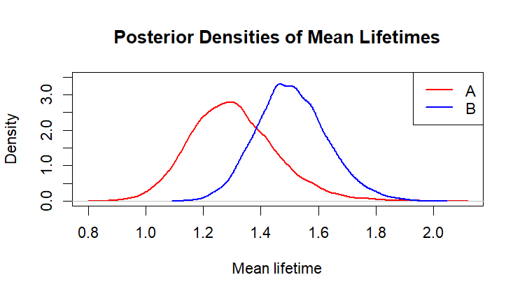

# Bayesian Inference and Gibbs Sampling for Reliability Analysis

A Year 3 statistics project completed at Heriot-Watt University Malaysia, applying Bayesian inference and Markov Chain Monte Carlo methods to analyse component reliability using R.

| Detail | Information |
|---|---|
| Program | Bachelor of Science (Hons) in Statistical Data Science |
| Course | F79BI Bayesian Inference and Computational Methods |
| Year and Semester | Year 2, Semester 2 |
| Date | March 2026 |
| Language | R |
| Tool | RStudio |
| Marks Obtained | 40/40 |

## About the Project

Investigated the lifetime performance of lightbulbs from two manufacturers using a Bayesian statistical model.

Gamma distributions were used to represent the lifetime distributions of the two manufacturers. Bayesian inference was applied to estimate unknown parameters, and a Gibbs sampling algorithm was implemented in R to obtain samples from the joint posterior distribution.

## What I Did

- Derived the joint posterior distribution and conditional posterior distributions.
- Implemented a Gibbs sampler using Gamma conditional distributions.
- Generated posterior samples using 100,000 MCMC iterations with burn-in and thinning.
- Evaluated Markov Chain convergence using trace plots and autocorrelation functions.
- Analysed posterior distributions using histograms and numerical summaries.
- Compared posterior mean lifetimes to determine which manufacturer produced longer-lasting lightbulbs.

## Results

### MCMC Convergence Diagnostics

#### Trace Plot of β

The trace plot shows the sampled values of β throughout the MCMC iterations. The chain fluctuates around a stable region without noticeable trends, indicating satisfactory convergence.

#### Trace Plot of θ

The θ chain also demonstrates stable mixing, suggesting that the Gibbs sampler successfully explored the posterior distribution.

---

### Posterior Distribution Analysis

#### Posterior Distribution of β

The posterior samples of β form a unimodal distribution centred around the posterior mean, indicating a concentrated estimate of the parameter.

#### Posterior Distribution of θ

The posterior distribution of θ shows similar behaviour, providing an estimate of uncertainty surrounding the parameter.

---

### Autocorrelation Analysis

#### Autocorrelation of β

#### Autocorrelation of θ

Both autocorrelation plots show low correlation between retained samples, indicating that thinning successfully reduced dependence between successive MCMC samples.

---

### Joint Posterior Distribution

The joint posterior samples illustrate the relationship between β and θ after Gibbs sampling. The negative association indicates the interaction between the two parameters within the posterior model.

---

### Manufacturer Lifetime Comparison

Posterior lifetime distributions were compared between manufacturers.

The analysis estimates the uncertainty of the mean lifetime for each manufacturer, allowing conclusions to be drawn about which manufacturer is more likely to produce longer-lasting lightbulbs. In this case, it is evidently clear that manufacturer B is more likely to produce longer-lasting lightbulbs.

## Skills Demonstrated

- Bayesian statistical modelling.
- Markov Chain Monte Carlo (MCMC).
- Gibbs sampling implementation.
- Posterior distribution analysis.
- Statistical simulation using R.
- Reliability modelling and uncertainty quantification.

## Availability

The full submitted report and R script are kept private but can be requested by contacting me at: 29natasha.sj@gmail.com

---

[Back to Statistical Data Science Projects](../README.md)
