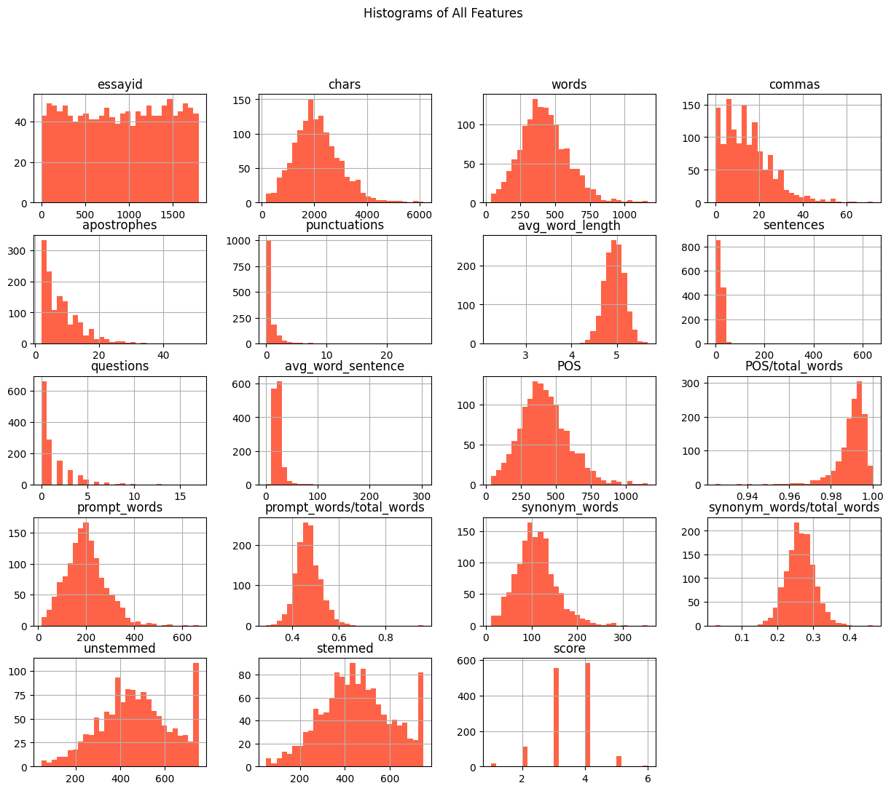
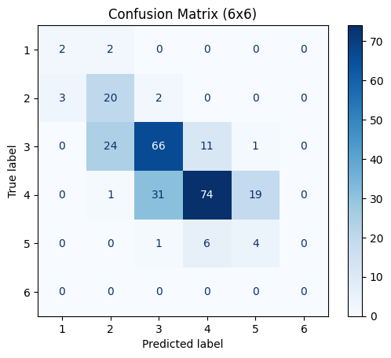

# Automated Essay Scoring with Machine Learning

A Year 2 data science project completed at Heriot-Watt University Malaysia, applying supervised machine learning techniques to predict essay scores from extracted textual features.

| Detail | Information |
|---|---|
| Program | Bachelor of Science (Hons) in Statistical Data Science |
| Course | F78DS Data Science Life Cycle |
| Year and Semester | Year 2, Semester 2 |
| Date | April 2025 |
| Language | Python |
| Tool | Jupyter Notebook |
| Libraries | Pandas, NumPy, Matplotlib, Seaborn, Scikit-learn |

## About the Project

Developed a machine learning pipeline to predict essay scores using numerical features extracted from written essays.

The project involved exploratory data analysis, feature engineering, data preprocessing, classification modelling and evaluation using the Quadratic Weighted Kappa (QWK) metric.

## What I Did

- Explored essay feature data using descriptive statistics and visualisations.
- Analysed feature relationships using correlation analysis.
- Created additional features to improve model inputs.
- Prepared labelled data for supervised learning.
- Applied feature scaling using Quantile Transformer.
- Built classification models using Gaussian Naive Bayes and Random Forest.
- Evaluated model performance using accuracy, F1-score, confusion matrices and QWK.

## Results

### Feature Distribution Analysis

Histograms were used to understand the distribution of essay features. The analysis showed that many features were not normally distributed, highlighting the need for preprocessing before applying machine learning models.

### Feature Correlation Analysis

The correlation heatmap was used to investigate relationships between essay features and scores. Features such as essay length, word count and vocabulary-related features showed stronger positive relationships with essay scores.

### Model Performance Comparison

Two classification models were evaluated:

- Gaussian Naive Bayes achieved a QWK score of 0.7208.
- Random Forest achieved a higher QWK score of 0.7448.

The Random Forest model demonstrated better overall performance based on QWK, accuracy and F1-score.

### Gaussian Naive Bayes Confusion Matrix

The confusion matrix shows the classification performance of Gaussian Naive Bayes across the six essay score categories.

### Random Forest Confusion Matrix

The Random Forest model achieved improved classification results, particularly for the middle score categories, compared with Gaussian Naive Bayes.

## Skills Demonstrated

- Exploratory data analysis.
- Data preprocessing and feature engineering.
- Supervised machine learning classification.
- Model evaluation and comparison.
- Python programming with Scikit-learn.
- Data visualisation using Matplotlib and Seaborn.

## Availability

The full coursework notebook and submission files are kept private but can be requested by contacting me at: 29natasha.sj@gmail.com

---

[Back to Statistical Data Science Projects](../README.md)
