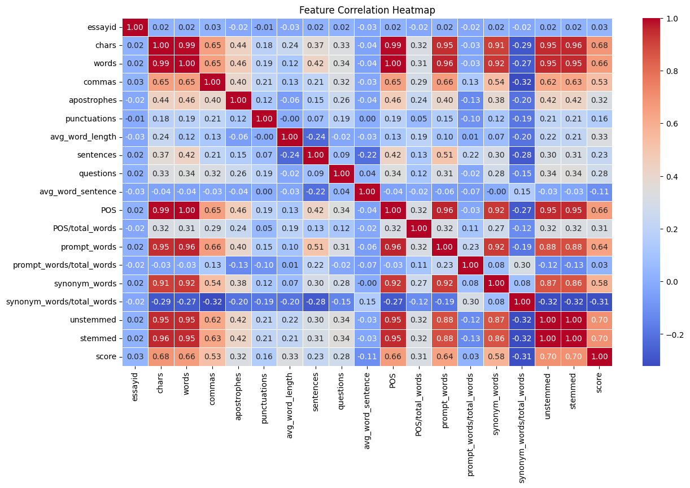
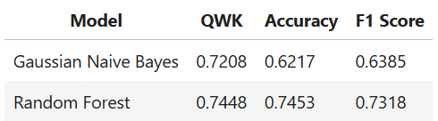
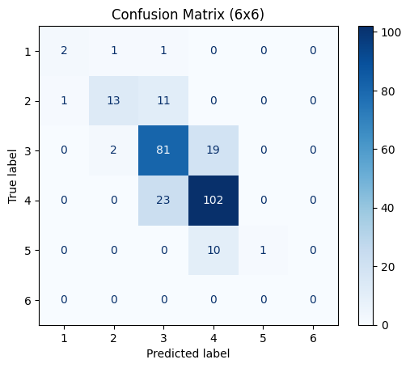

# Essay Score Prediction with Supervised Machine Learning

A Year 2 data science project completed at Heriot-Watt University Malaysia, applying supervised machine learning techniques to predict essay scores from extracted textual features.

| Detail | Information |
|---|---|
| Program | Bachelor of Science (Hons) in Statistical Data Science |
| Course | F78DS Data Science Life Cycle |
| Year and Semester | Year 2, Semester 2 |
| Date | April 2025 |
| Language | Python |
| Libraries | Pandas, NumPy, Matplotlib, Seaborn, Scikit-learn |
| Tool | Jupyter Notebook |
| Marks Obtained | 28.33/30 |

## About the Project

Developed a machine learning pipeline to predict essay scores using numerical features extracted from written essays.

The project involved exploratory data analysis, feature engineering, data preprocessing, classification modelling and model evaluation using the Quadratic Weighted Kappa metric.

## What I Did

- Analysed essay feature distributions and relationships.
- Performed feature engineering to improve model input.
- Prepared labelled data for supervised learning.
- Applied feature scaling and train-test splitting.
- Built classification models using Naive Bayes and Random Forest.
- Evaluated model performance using accuracy, F1-score, confusion matrices and QWK.

## Results

### Feature Correlation Analysis

The correlation analysis identified relationships between essay characteristics and final scores.

### Model Evaluation

Classification models were compared using multiple evaluation metrics, including Quadratic Weighted Kappa.

### Confusion Matrix

The confusion matrix shows how accurately the model classified essays across the six score categories.

## Skills Demonstrated

- Supervised machine learning.
- Feature engineering.
- Classification modelling.
- Model evaluation.
- Exploratory data analysis.
- Python programming with Scikit-learn.

## Availability

The full coursework Jupyter notebook and Python code are kept private but can be requested by contacting: 29natasha.sj@gmail.com

---

[Back to Statistical Data Science Projects](../README.md)
