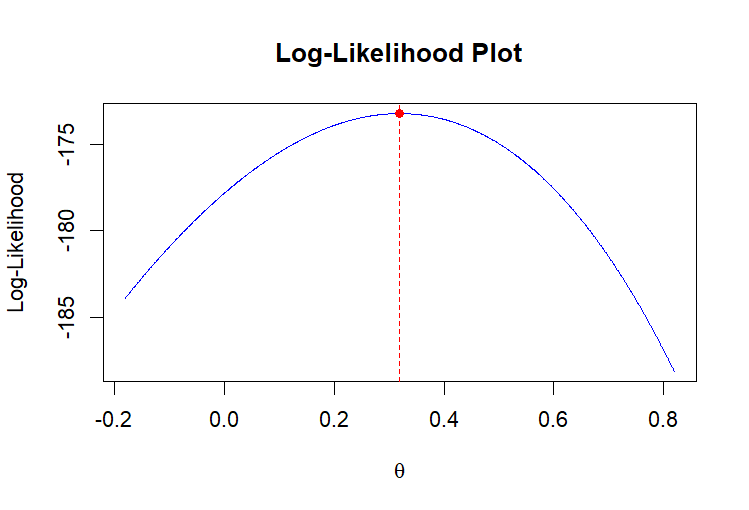
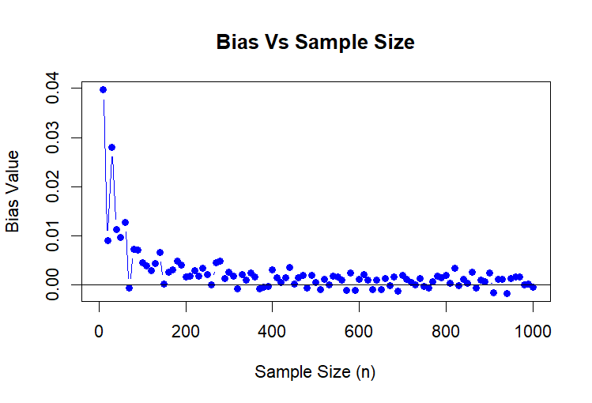
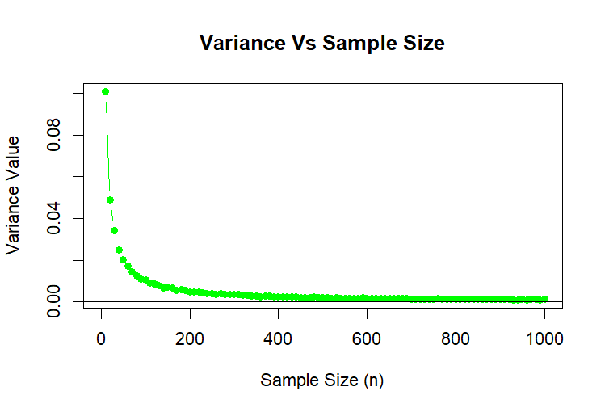
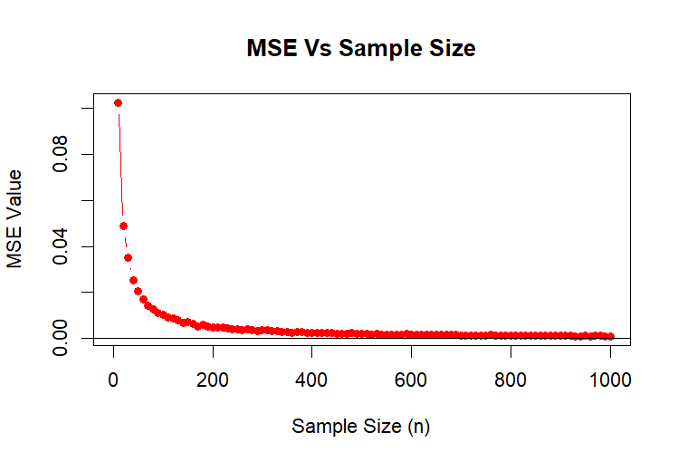

# Statistical Models A — Estimation and Simulation

A Year 2 statistics project completed at Heriot-Watt University Malaysia, combining mathematical analysis with simulations in R.

| Detail | Information |
|---|---|
| Date | October 2024 |
| Course | F79MA Statistical Models A |
| Language | R |
| Tool | RStudio |

## About the Project

Investigated the behaviour of a maximum likelihood estimator for a probability distribution introduced in an insurance modelling scenario. Mathematical derivations and simulations were used to examine how estimation accuracy changes with sample size.

## My Contribution

- Derived the maximum likelihood estimator, score function, Fisher information and Cramér–Rao lower bound.
- Developed R analysis code using the supplied data-generation script.
- Calculated approximate 95% confidence intervals using asymptotic normality and the deviance function.
- Examined bias, variance and mean squared error across different sample sizes.
- Produced plots and wrote a report explaining the findings.

## Results

### Maximum Likelihood Estimate

The log-likelihood curve reaches its maximum at the estimated parameter value, highlighted in red.

### Bias

The simulated bias generally approaches zero as sample size increases, with some variation between simulations.

### Variance

The variance decreases as sample size increases, indicating that estimates become less variable across repeated samples.

### Mean Squared Error

Mean squared error decreases as sample size increases, indicating improved estimation accuracy in the simulation.

These results concern simulated data under the specified model; they do not establish how well the model fits real insurance claims.

## Skills Demonstrated

- Statistical inference and mathematical reasoning.
- Simulation and data visualisation in R.
- Evaluating estimator performance.
- Interpreting and communicating statistical results.

## Availability

The full submitted report and R script are kept private.

---

[Back to Degree Projects](../README.md)
