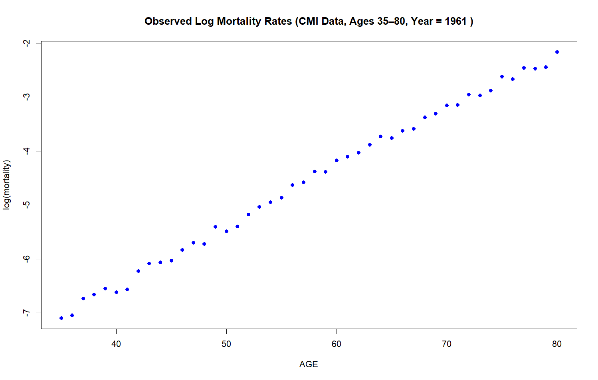
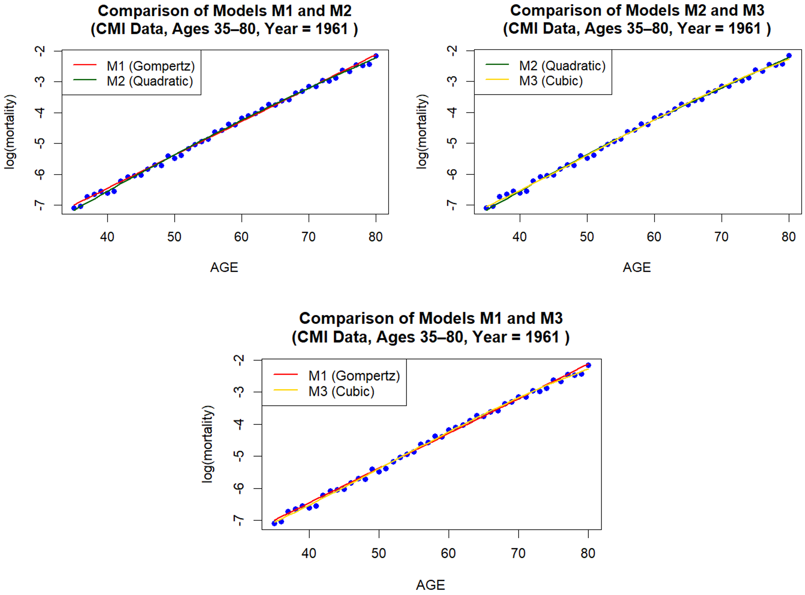
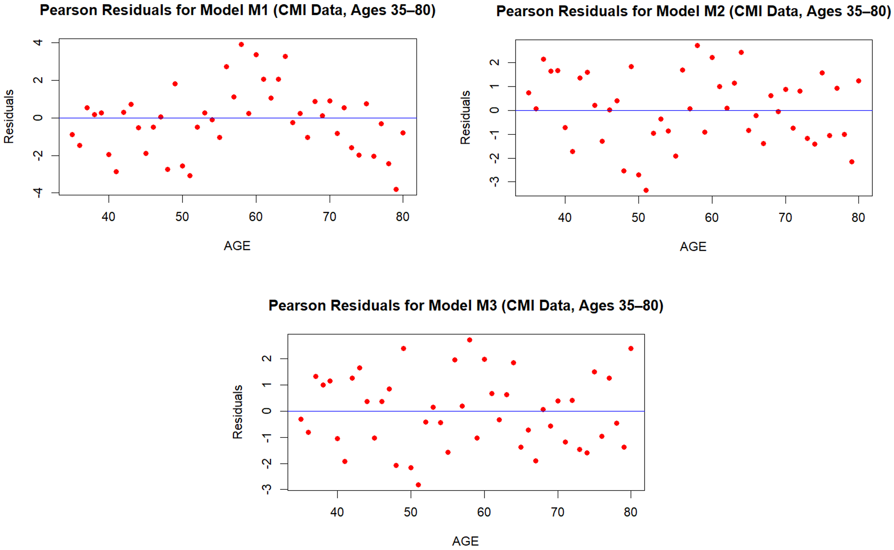

# Survival Models and Mortality Graduation Using Poisson GLMs

A Year 2 statistics project completed at Heriot-Watt University Malaysia, applying survival modelling techniques, mortality graduation and Generalised Linear Models (GLMs) using R.

| Detail | Information |
|---|---|
| Program | Bachelor of Science (Hons) in Statistical Data Science |
| Course | F79SU Survival Models |
| Year and Semester | Year 2, Semester 2 |
| Date | March 2026 |
| Language | R |
| Tool | RStudio |
| Marks Obtained | 22.5/25 |

---

## About the Project

This project analysed mortality data from the Continuous Mortality Investigation (CMI) dataset and applied survival modelling techniques to study mortality patterns across different ages.

The objective was to graduate mortality rates using Poisson Generalised Linear Models (GLMs) and compare different mortality graduation models:

- **M1:** Gompertz linear model
- **M2:** Quadratic model
- **M3:** Cubic model

The fitted models were evaluated using Pearson residual diagnostics, goodness-of-fit testing and Akaike Information Criterion (AIC) to determine the most suitable mortality model.

---

## Dataset

The project used CMI mortality data consisting of:

- Number of deaths
- Exposure to risk
- Age groups
- Calendar years

The data preparation involved reading mortality and exposure datasets, converting exposures into central exposures, and selecting the required age and year ranges before modelling.

The included R scripts contain the data processing steps and goodness-of-fit functions used throughout the analysis.

---

# Methodology

The following statistical methods were applied:

- Mortality rate estimation
- Log mortality transformation
- Poisson Generalised Linear Models
- Gompertz mortality graduation
- Polynomial extensions of mortality curves
- Pearson residual analysis
- Goodness-of-fit testing
- Akaike Information Criterion (AIC) model comparison

---

# Analysis and Results

## Observed Log Mortality Rates

The observed log mortality rates show an increasing relationship between age and mortality.

The approximately linear pattern supports the use of the Gompertz mortality model as a starting point. However, some deviations from linearity can be observed, suggesting that more flexible models may provide improved fitting performance.

---

## Mortality Model Comparison

Three mortality graduation models were fitted and compared:

| Model | Description |
|---|---|
| M1 | Gompertz linear model |
| M2 | Quadratic extension model |
| M3 | Cubic extension model |

The quadratic and cubic models introduced additional flexibility to capture possible curvature in mortality trends.

The comparison showed that the extended models provided improved fitting behaviour compared with the standard Gompertz model, particularly where the observed mortality trend deviated from a simple linear relationship.

---

## Pearson Residual Diagnostics

Pearson residuals were examined to assess the adequacy of each fitted mortality model.

The residual analysis was used to identify possible systematic patterns and evaluate whether the models adequately represented the observed mortality data.

The more flexible models reduced some of the deviations observed under the basic Gompertz model, indicating improved model suitability.

---

# Model Evaluation Using AIC

Akaike Information Criterion (AIC) was used to compare the competing mortality models.

A lower AIC value indicates a better balance between goodness-of-fit and model complexity.

| Model | AIC |
|---|---:|
| M1 (Gompertz) | 502.0279 |
| M2 (Quadratic) | 461.5505 |
| M3 (Cubic) | 452.4380 |

Based on the AIC comparison, **M3 (Cubic Model)** achieved the lowest AIC value and was selected as the preferred model. The cubic model provided the best balance between flexibility and goodness-of-fit among the tested approaches.

---

# Goodness-of-Fit Testing

The fitted models were further evaluated using statistical tests including:

- Chi-square goodness-of-fit test
- Standardised deviation tests
- Sign test
- Change of signs test
- Runs test
- Serial correlation test

These tests were used to evaluate whether residuals showed systematic patterns and whether the mortality graduation models adequately represented the observed data.

---

# Skills Demonstrated

- Survival analysis
- Mortality modelling
- Actuarial statistics
- Generalised Linear Models (GLMs)
- Poisson regression
- Model comparison
- Residual diagnostics
- Goodness-of-fit testing
- Statistical hypothesis testing
- R programming
- Data visualisation

---

# Files Included

## Data Files

### `CMI_Deaths.csv`

Contains mortality death counts used for estimating mortality rates.

### `CMI_Exposures.csv`

Contains exposure data used alongside death counts to calculate mortality rates.

## R Scripts

### `CMI_read.r`

Used for importing and preparing the CMI mortality datasets, including converting exposure values into central exposures and selecting the required age and year ranges.

### `Test_GoF.r`

Contains functions for statistical goodness-of-fit testing, including chi-square tests, standardised deviation tests, sign tests, runs tests and serial correlation tests.

---

# Conclusion

This project demonstrated the application of survival modelling techniques to mortality data using Poisson Generalised Linear Models.

Through model comparison, residual diagnostics and AIC evaluation, the cubic mortality graduation model was identified as the most suitable model among the tested approaches.

The project highlights the application of statistical modelling techniques in actuarial contexts, including mortality analysis and risk modelling.

---

# Availability

This repository contains:

- Dataset files
- R scripts
- Selected statistical visualisations

The original coursework report is not included.

---

[Back to Degree Projects](../README.md)
