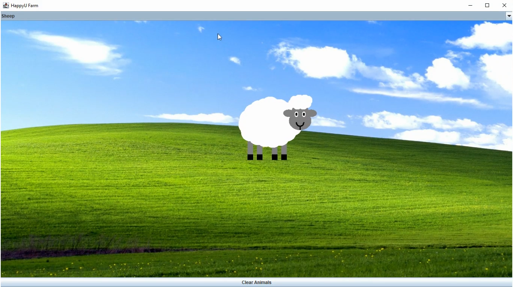

# HappyU Farm

An interactive Java farm application developed as a foundation group project at Heriot-Watt University Malaysia.

| Detail | Information |
|---|---|
| Date | March 2023 |
| Course | K17SD Data Structures and Software Design |
| Language | Java |
| Libraries and Tools | Swing, AWT, Java 2D, Eclipse IDE |

## About the Project

HappyU Farm allows users to select animals from a dropdown menu and add them to a graphical farm scene. The animals are drawn programmatically using Java shapes, move across the scene and respond to mouse dragging. A Clear Animals button removes them from the farm.

## My Contribution

- Designed and programmed the sheep character using ellipses, rectangles, lines and arcs.
- Helped incorporate the background image and get the application running.

## Skills Demonstrated

- Drawing graphics programmatically using Java 2D.
- Positioning and layering shapes to build a character.
- Contributing an individual component to a shared Java application.

## Preview

## Demo

[Watch the application demo](demo.mp4)

---

[Back to Foundation Projects](../README.md)
