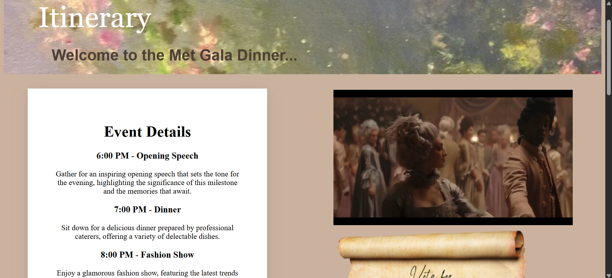
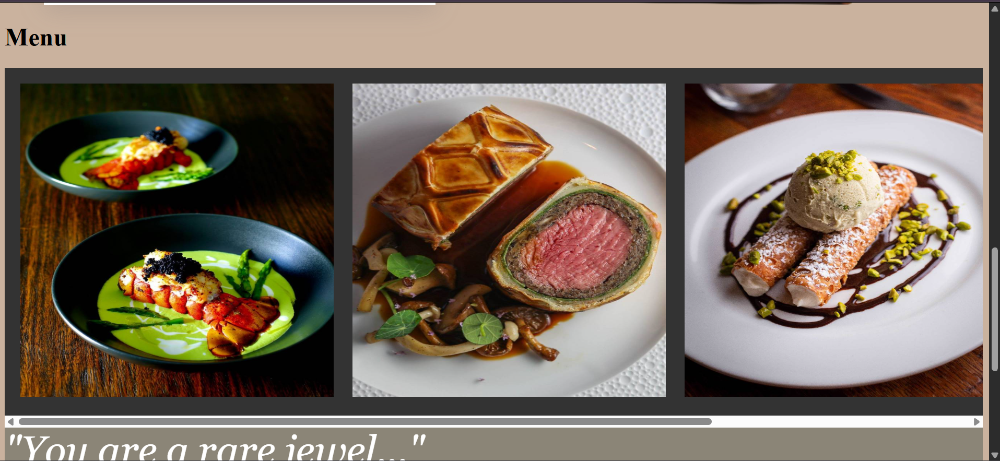

# HappyU Met Gala Dinner Website

A Bridgerton-themed event website developed as a foundation group project at Heriot-Watt University Malaysia.

| Detail | Information |
|---|---|
| Program | Higher Education in Foundation in Business, Actuarial Science |
| Course | K17SW Web Development and Databases |
| Semester | Semester 3 |
| Date | May 2023 - June 2023 |
| Languages | HTML, CSS, JavaScript, PHP, SQL |
| Tools | SQLite, XAMPP |

## About the Project

A website for HappyU’s Gala Dinner 2023, featuring event information, an itinerary, registration, payment information and an administrator login page. PHP and SQLite were used to store participant details.

## My Contribution

- Contributed to the website’s visual design.
- Created the About Us page, presenting the founder, venue, theme and music.
- Created the administrator login page interface.
- Added a video and a horizontally scrollable food menu to the itinerary page.

## Skills Demonstrated

- Structuring web pages using HTML.
- Styling layouts, forms and horizontally scrollable content using CSS.
- Integrating images, videos and an embedded Spotify playlist.
- Contributing individual pages and features to a shared website.

## Screenshots and Demos

### About Us Page

The founder, venue, Bridgerton theme and music sections.

[Watch the About Us page demo](videos/about%20page%20demo.mp4)

### Administrator Login Page

The administrator login interface.

[Watch the administrator login demo](videos/administrator%20login%20demo.mp4)

### Itinerary Page

The itinerary page shows the video and horizontally scrollable food menu I added.

[Watch the itinerary and menu demo](videos/itinerary_menu%20demo.mp4)

---

[Back to Foundation Projects](../README.md)
