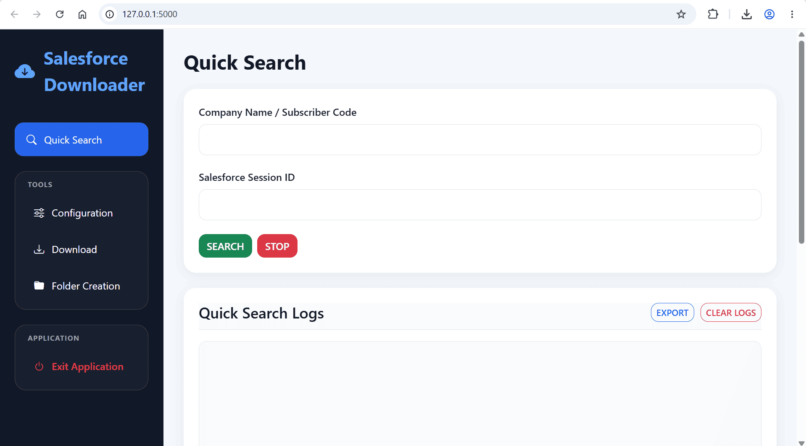
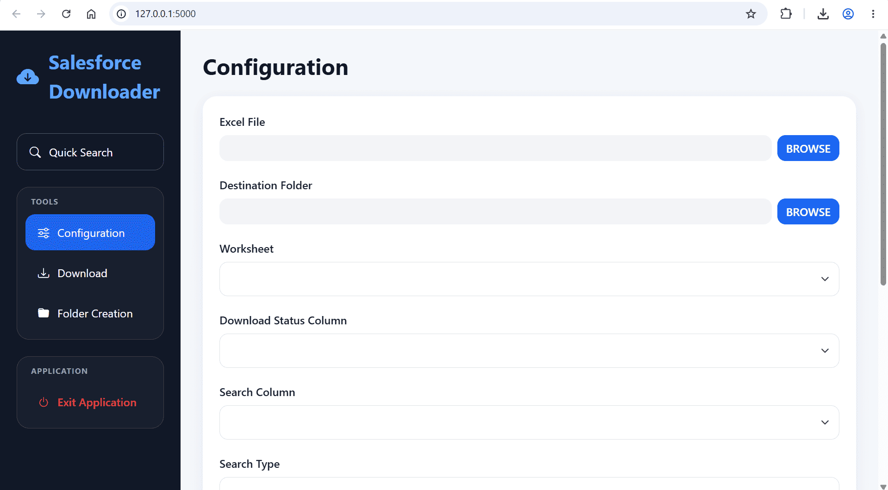
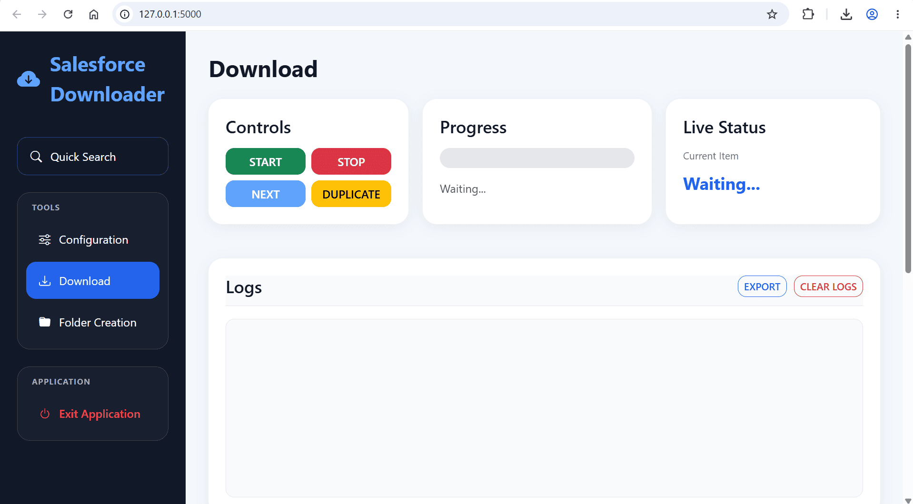
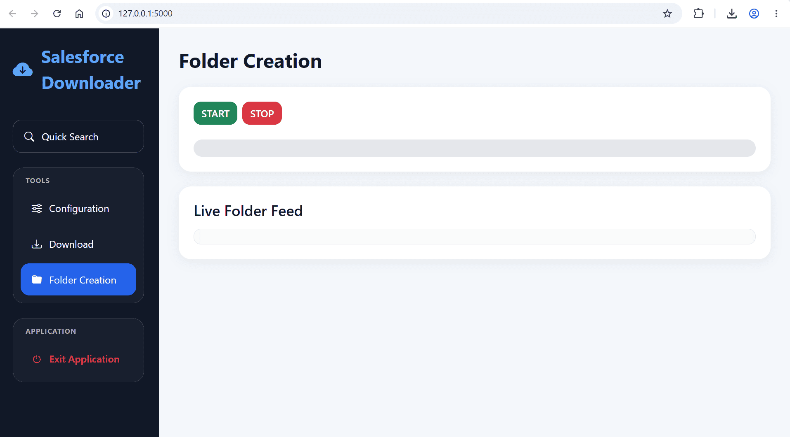
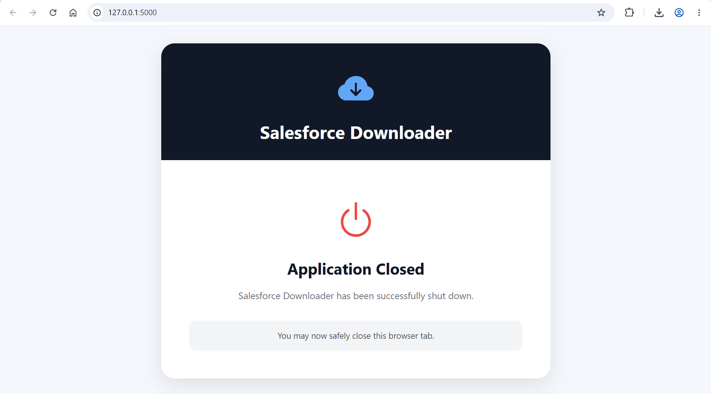

# Salesforce Downloader Process Automation Tool

A process automation application developed during my internship at **Experian Information Services (Malaysia) Sdn. Bhd.** to support the Stamp Duty Project workflow by improving Salesforce document retrieval, file organisation and operational processing efficiency.

| Detail | Information |
|---|---|
| Company | Experian Information Services (Malaysia) Sdn. Bhd. |
| Job Position | Stamp Duty Project Intern |
| Date | May 2026 – August 2026 |
| Languages | Python, HTML, CSS, JavaScript |
| Tool/Software | Python, Visual Studio Code |
| Libraries | Flask, Flask-SocketIO, simple-salesforce, pywin32, requests, python-socketio, python-engineio, simple-websocket |

## About the Project

As part of Experian's Stamp Duty Project, the team was responsible for processing and submitting contract documents through the LHDN STAMPS portal. The workflow involved retrieving documents from Salesforce, preparing files, organising documentation, tracking submission status and maintaining accurate records.

To improve operational efficiency, a **Process Automation Tool** was developed to streamline repetitive document processing tasks, particularly in Salesforce document retrieval, download management and folder organisation.

The application provides an interactive dashboard that allows users to configure workflows, monitor processing progress, manage logs and automate file organisation. This reduces manual effort, improves consistency and provides better visibility throughout the document preparation process.

Due to confidentiality requirements, production Salesforce data, contract documents and sensitive business information are not included in this portfolio.

---

# Features Developed

## Quick Search Dashboard

A search interface developed to assist users in retrieving Salesforce-related records using configurable inputs.

Features include:

- Company Name / Subscriber Code search.
- Salesforce session-based searching.
- Search activity logging.
- Export and log management functions.

---

## Configuration Module

A configuration interface developed to customise the document retrieval workflow before processing.

Features include:

- Excel input file selection.
- Destination folder selection.
- Worksheet selection.
- Download status column mapping.
- Search column configuration.
- Workflow parameter setup.

---

## Download Management Dashboard

A dashboard developed to monitor and control the automated Salesforce document download process.

Features include:

- Start and stop controls.
- Real-time progress monitoring.
- Current item tracking.
- Processing activity logs.
- Export and clear log functions.

---

## Automated Folder Creation

A module developed to automate document organisation and maintain structured file storage.

Features include:

- Automated folder creation.
- Progress tracking.
- Live folder creation monitoring.
- Improved document organisation workflow.

---

## Application Control

Implemented a controlled application exit process to allow users to safely close the tool after completing workflow activities.

---

# Demo

A demonstration video showcasing the application's workflow and interface:

[Watch Process Automation Tool Demo](demo/Salesforce_Downloader_Demo.mp4)

**Note:** The demonstration excludes confidential Salesforce information, contract documents and production data.

---

# What I Did

During my internship at Experian, I developed a **Stamp Duty Project Process Automation Tool** to support operational workflow improvements.

My contributions included:

- Analysed existing workflow requirements and identified opportunities for automation.
- Developed application features using Python and Flask.
- Built interactive dashboard interfaces for different process stages.
- Implemented Salesforce document retrieval automation.
- Developed file management and folder organisation features.
- Created logging and progress monitoring functions.
- Improved workflow visibility by providing users with real-time processing information.
- Tested and refined application functionality based on operational requirements.

---

# Skills Demonstrated

- Python application development.
- Flask web application development.
- Business process automation.
- Salesforce workflow integration.
- File processing and Excel automation.
- Dashboard design and development.
- User interface development.
- Operational workflow optimisation.
- Software testing and debugging.
- Enterprise automation solution development.

---

# Project Impact

The Process Automation Tool helped improve the efficiency and consistency of document processing activities by reducing repetitive manual tasks.

Key improvements included:

- Reduced manual document retrieval and organisation steps.
- Improved consistency in file management.
- Provided clearer monitoring of processing activities.
- Supported a more structured workflow for operational teams.

---

# Confidentiality Notice

This project was completed during my internship at **Experian Information Services (Malaysia) Sdn. Bhd.**

Due to confidentiality requirements:

- Production Salesforce data is not included.
- Contract documents and sensitive business information have been removed.
- Screenshots and demonstrations only showcase the application's interface and workflow.

---

[Back to Internship Projects](../README.md)
